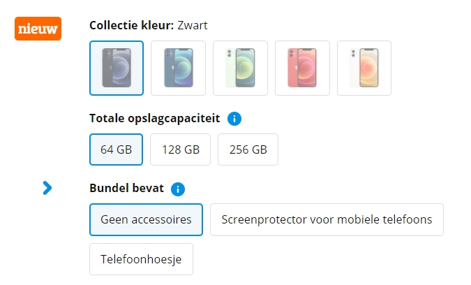
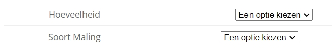
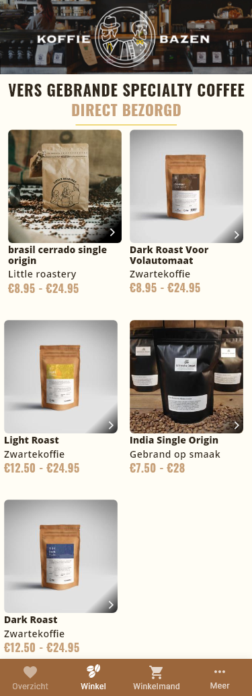
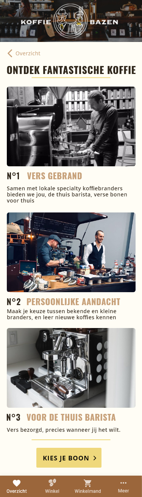

## Introduction 

Koffiechefs is a platform where coffee roasters can offer their bespoke roasted coffees. These coffees can be bought by normal consumers. The concept is similar to a webshop where the products can be supplied by everyone that registers on the platform. A bit like Bol.com or Amazon but specifically for coffee.

## Table of Contents
1. [How to install](#How-to-install)
2. [Technologies](#Technologies)
3. [Product Vision](#Product-Vision)
4. [Drivers](#Drivers)
   - 4.1 [Functional Requirements](#Functional-Requirements)
3. [Licence](#Licence)


## How to install

**Step 1:** Clone project:
```git
git clone https://github.com/meessour/Koffie-Bazen.git
```

**Step 2:** CD to path of the project's root:
```git
cd C:/../..
```

**Step 3:** Install:
```git
npm install
```

## Technologies

File structure: https://medium.com/the-andela-way/how-to-structure-a-react-native-app-for-scale-a29194cd33fc

Atom Design: https://bradfrost.com/blog/post/atomic-web-design/

navigation and routing: https://reactnavigation.org/

Icons: https://www.npmjs.com/package/react-native-vector-icons

Custom icons creation: https://icomoon.io/

Fast images: https://github.com/DylanVann/react-native-fast-image

styled components

in StoreItems.tsx line 66 & 67 I use a variable in rgba, not hex because styled compeonntes can't work with a #. Bron: https://stackoverflow.com/a/43506649

Store items in localstorage: https://github.com/react-native-async-storage/async-storage

## Inspiration

The selection of the bean amount and type of grind is inspired by the selection of coolblue.nl, see image down below for their implementation.

This implementation shows an overview of all the options without having to click a dropdown first as example. The website of koffiebazen (koffiebazen.nl) has this as implementation: 



## Product Vision

We have received a document citing all the requirements for this project, categorized in user type. These requirements use the MOSCOW method with each requirement identified with a Must have, should have or could have. 
Our project is defined by these requirements and so is our product vision.

This app is for Roasters of coffee and enthusiastic drinkers of coffee, who want to sell or buy freshly homemade coffee beans. The Koffiechefs app is currently an android app that allows a home roaster to sell his coffee beans easily and securely with direct payments to the roaster. Unlike buying from other online stores, our product guarantees that all coffee beans on the app will be homemade and not from some factory.

Here are a few mockups of Koffiechefs:




## Drivers

### Functional Requirements

Here are all our requirements which are in the form of user stories that are managed by Jira:

| Requirement ID | Description 
| --- | --- |
| KOF-1 | As a customer, I want to be able to take a quiz, so that I can find out which coffee is most suitable for me.
| KOF-2 | As a customer, I want to be able to see coffee based on a filter.
| KOF-3 | As a customer, I want to be able to browse the entire coffee database, so that I can find a coffee that I like.
| KOF-4 | As a customer, I want to be able to add coffee to my cart.
| KOF-5 | As a customer, I want to be able to pay on this platform
| KOF-6 | As a customer, I want to be able to subscribe to news letter.
| KOF-7 | As a customer, I want to be able to Create, Read, Update and Delete my account
| KOF-8 | As a customer, I want to be able to manage my quiz results
| KOF-10| As a customer, I want to be able to see my browse order history
| KOF-11 | As a customer, I want to be able to see recommendations based on results from my quiz and order history
| KOF-12 | As a customer, I want to be able to collect "Stamps" based on orders and total value. (For free Coffee)
| KOF-13 | As a customer, I want to be able to receive an order confirmation via E-mail
| KOF-14 | As a customer, I want to be able to order without creating an account
| KOF-15 | As a roaster, I want to be able to request an info page for "Becoming a roaster"
| KOF-16 | As a roaster, I want to complete an online application form.
| KOF-18 | As a roaster, I want to be able to Read, Update and request for deletion of my account.
| KOF-20 | As a roaster, I want to be able to fill in details about my coffee
| KOF-21 | As a roaster, I want to be able to create a quiz for the customers
| KOF-22 | As a roaster, I want to be able to see a detailed rapport on earnings, commisions and payment date.
| KOF-23 | As a roaster, I want to be able to get detailed information about my customers
| KOF-24 | As a roaster, I want to be able to get detailed information about the popularity of my coffees
| KOF-25 | As a roaster, I want to be able to see incoming orders
| KOF-26 | As a roaster, I want to review order details
| KOF-27 | As a roaster, I want to be able to message the customers
| KOF-28 | As a roaster, I want to be able to export my orders and earnings to CSV
| KOF-29 | As an admin, I want to be able to create invoices automatically.
| KOF-30 | As an admin, I want to be able to Create, Read, Update en delete new/existing Roasters and Customers
| KOF-31 | As an admin, I want to be able to Accept/Deny/Comment to incoming requests from Roasters.
| KOF-32 | As an admin, I want to be able to see earnings analysis
| KOF-33 | As an admin,  I want to be able to automatically calculate the commision per Roaster
| KOF-34 | As an admin, I want to be able to view individual customer details
| KOF-35 | As an admin, I want to be able to view orders and preferences of customers
| KOF-36 | As an admin, I want to be able to export data of a customers.
| KOF-37 | As an admin, I want to be able to change settings
| KOF-38 | As an admin, I want to be able to see and overview key insights
| KOF-40 | As an roaster, I want to congregate the data for the quiz and implement them automatically to the quiz
| KOF-45 | As an admin, I want to be able to login as Admin
| KOF-46 | As a customer, I want to be able to login as a customer
| KOF-47 | As a roaster, I want to be able to login as Roaster

## Licence
MIT © [Koffiechefs](https://github.com/meessour)
